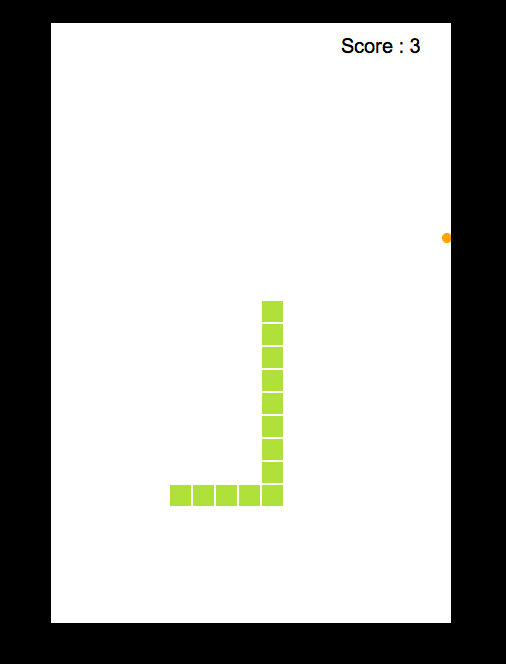

# Snake 2d

* __What does this project do?__
  This is Snake clone created using HTML5 and Javascript.

* __Why is this project useful?__
This project is created to get user familiar with HTML5 canvas,DOM and javascript to create awesome games and have fun together as a community. This is a friendly project and any kind of ideas crazy or creative are accepted.

* __How do I get started?__
Check out issues section and see which issue can you fix. Follow javascript ES6 coding standards in all commits.
If you find a way to improve the game that hasn't been mentioned in the issues. Create a new issue. And most important of all discuss with your peers on what is the best way to solve a problem

* __Where can I get more help, if I need it?__
You can contact the owner at techie.vigneshramesh@gmail.com

* __How to play?__
Don't run the snake into the wall, or his own tail: you die.

Use your cursor keys: up, left, right, and down to control the snake. 

Eat the colored dots to gain points and collecting more dots will result in increment in the size of the snake.

Higher (and faster) play levels award more points.

## Playing Screenshot

